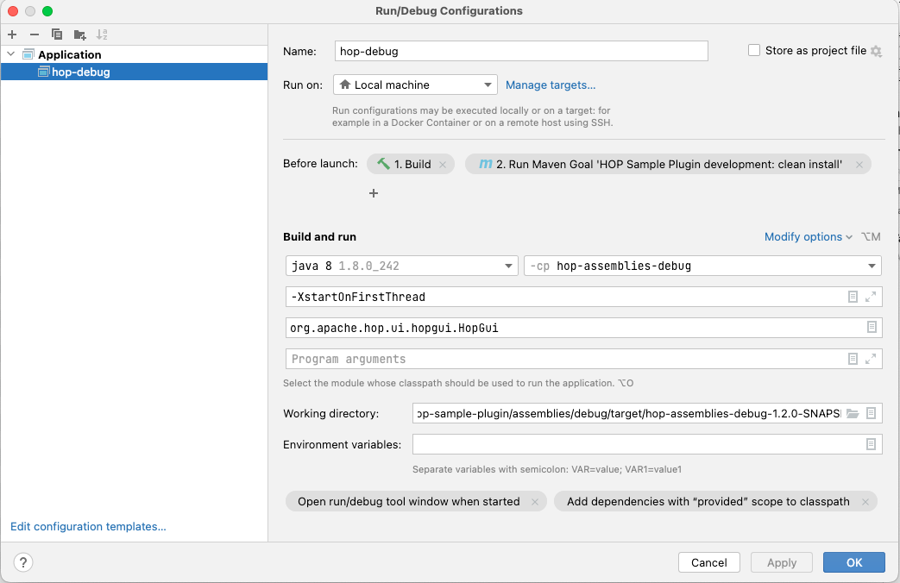

# Apache Hop plugins Samples

### Pre-requisites for building the project:
* Maven, version 3+
* Java JDK 1.8

## Overview

This project contains a series of examples demonstrating various use-cases for extended and embedding Apache Hop functionality. As a first implementation, the following plugins' examples are provided

* Hop Pipeline Transform
* Hop Workflow Action

More examples will be provided shortly

## Building

From the main directory, or any of the module sub-directories, run `mvn clean package`.

For any module contained in the samples, a zip file will be generated that can be unzipped into the related Apache Hop plugin subdirectory for testing. This project is currently under improvement and any other samples wil lbe provided soon.

## Using the debug Assembly

You can run Hop including some basic functionality using the debug assembly included, this will launch a stripped down version for Hop including a couple of transforms to test your custom transform or action.

Instructions on how to run debug using **Intellij**:

- Create a new Run/Debug Configuration
- Choose type application 
- Give it a name
- From the Modify Options menu select following opitons
    - Add before launch task
    - Add VM Options
- In the before launch add build & run maven goal -> clean install
- Use Java 8
- set module to hop-assemblies-debug
- (if on mac) add -XstartOnFirstThread as VM option
- Main Class is `org.apache.hop.ui.hopgui.HopGui`
- Working director is `your-git-location/pluginname/assemblies/debug/target/hop-assemblies-debug-{VERSION}`

The {VERSION} should be replaced with the pom version you use.

Run this application and Hop should show up including your custom plugins.

